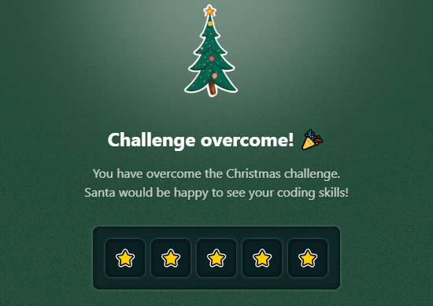

# Challenge 07

The **grinch** 👹 has passed through Santa Claus's workshop! And what a mess he has made. He has changed the order of some packages, so shipments cannot be made.

Luckily, the elf **Pheralb** has detected the pattern the grinch followed to jumble them. **He has written the rules that we must follow to reorder the packages**. **The instructions are as follows**:

You will receive a string containing letters and parentheses.
Every time you find a pair of parentheses, you need to reverse the content within them.
If there are nested parentheses, solve the innermost ones first.
Return the resulting string with parentheses removed, but with the content correctly reversed.

```js
fixPackages('a(cb)de')
// Expected result: "abcde"
// We reverse "cb" inside the parentheses

fixPackages('a(bc(def)g)h')
// Expected result: "agdefcbh"
// 1st we reverse "def" -> "fed", then we reverse "bcfedg" -> "gdefcb"

fixPackages('abc(def(gh)i)jk')
// Expected result: "abcighfedjk"
// 1st we reverse "gh" -> "hg", then "defhgi" -> "ighfed"

fixPackages('a(b(c))e')
// Expected result: "acbe"
// 1st we reverse "c" -> "c", then "bc" -> "cb"
```

## Stars earned


