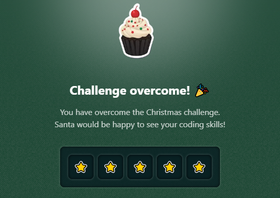

# Challenge 08

**It's time to select the fastest reindeer for Santa's journeys!** 🦌🎄

Santa Claus has organized exciting reindeer races to determine which ones are in the best shape.

Your task is to display each reindeer's progress on a snow track **in isometric format**.

The information you receive:

- `indices`: An array of integers representing each reindeer's progress on the track:
  - `0`: The lane is empty.
  - **Positive number**: The reindeer's current position from the beginning of the track.
  - **Negative number**: The reindeer's current position from the end of the track.
- `length`: The length of each lane.

Return a string representing the race track:

- Each lane has exactly `length` positions filled with snow (`~`).
- Each reindeer is represented with the letter `r`.
- Lanes are numbered at the end with `/1`, `/2`, etc.
- The view is **isometric**, so the lower lanes are shifted to the right.

```js
drawRace([0, 5, -3], 10)

// Expected result:
/*
  ~~~~~~~~~~ /1
 ~~~~~r~~~~ /2
~~~~~~~r~~ /3
*/

drawRace([2, -1, 0, 5], 8)

// Expected result:
/*
   ~~r~~~~~ /1
  ~~~~~~~r /2
 ~~~~~~~~ /3
~~~~~r~~ /4
*/

drawRace([3, 7, -2], 12)

// Expected result:
/*
    ~~~r~~~~~~~~ /1
  ~~~~~~~r~~~~ /2
~~~~~~~~~~r~ /3
*/
```

### Solutions

- [Python](./solution.py)
- [JavaScript](./solution.js)
- [TypeScript](./solution.ts)

## Stars earned


