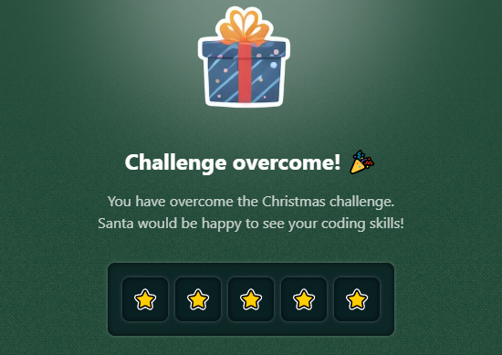

# Challenge 09

The elves are playing with a **magical train 🚂 that carries gifts**. This train moves on a board represented by an **array of strings**.

The train consists of an engine (`@`), followed by its carriages (`o`), and must collect magical fruits (`*`) which serve as fuel. The movement of the train follows these rules:

You will receive two parameters `board` and `mov`.

`board` is an array of strings that represents the board:

- `@` is the train's engine.
- `o` are the train's carriages.
- `*` is a magical fruit.
- `·` are empty spaces.

`mov` is a string that indicates the next movement of the train from the train's head `@`:

- `'L'`: left
- `'R'`: right
- `'U'`: up
- `'D'`: down.
  With this information, you must return a string:

- `'crash'`: If the train crashes into the edges of the board or itself.
- `'eat'`: If the train collects a magical fruit (`*`).
- `'none'`: If it moves without crashing or collecting any magical fruit.

```js
const board = ['·····', '*····', '@····', 'o····', 'o····']

moveTrain(board, 'U') // The train moves up and finds a magical fruit.
// Expected result: 'eat'

moveTrain(board, 'D') // The train moves down and the head crashes into itself.
// Expected result: 'crash'

moveTrain(board, 'L') // The train moves to the left and crashes into the wall.
// Expected result: 'crash'

moveTrain(board, 'R') // The train moves to the right and there is empty space on the right.
// Expected result: 'none'
```

## Stars earned


