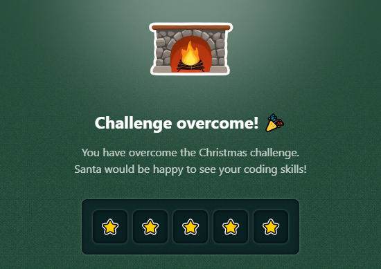

# Challenge 13

The elves at the North Pole have created a **special robot** 🤖 that helps Santa Claus distribute gifts inside a large warehouse. **The robot moves on a 2D plane and we start from the origin (0, 0)**.

We want to know if, after executing a series of movements, the robot returns to exactly where it started.

The robot's basic commands are:

- `L`: Move to the left.
- `R`: Move to the right.
- `U`: Move upwards.
- `D`: Move downwards.

But it also has certain modifiers for the movements:

- `*`: The movement is done with double intensity (e.g., `*R` means `RR`)
- `!`: The next movement is inverted (e.g., `R!L` is considered as `RR`)
- `?`: The next movement is done only if it hasn't been done before (e.g., `R?R` means `R`)

You must return:

- `true`: if the robot returns exactly to where it started.
- `[x, y]`: if the robot does not return to where it started, return the position where it stopped.

> [!NOTE]
> When the movement is inverted with `!` **the inverted movement is counted and not the original one**. For example, `!U?U` inverts the `U` movement, so it counts as having done the `D` movement but not the `U`. Thus, `!U?U` translates to `D?U`, and therefore, the final `U` movement is done.

```js
isRobotBack('R') // Expected result: [1, 0]
isRobotBack('RL') // Expected result: true
isRobotBack('RLUD') // Expected result: true
isRobotBack('*RU') // Expected result: [2, 1]
isRobotBack('R*U') // Expected result: [1, 2]
isRobotBack('LLL!R') // Expected result: [-4, 0]
isRobotBack('R?R') // Expected result: [1, 0]
isRobotBack('U?D') // Expected result: true
isRobotBack('R!L') // Expected result: [2,0]
isRobotBack('U!D') // Expected result: [0,2]
isRobotBack('R?L') // Expected result: true
isRobotBack('U?U') // Expected result: [0,1]
isRobotBack('*U?U') // Expected result: [0,2]
isRobotBack('U?D?U') // Expected result: true

// Step-by-step examples...

isRobotBack('R!U?U') // Expected result: [1,0]
/**
 * 0: 'R'  => moves to the right.
 * 1: '!U' => inverts and becomes 'D'.
 * 2: '?U' => moves upwards, because the 'U' movement hasn't been done yet.
 */

isRobotBack('UU!U?D') // Expected result: [0,1]
/**
 * 0: 'U'  => moves upwards.
 * 1: 'U'  => moves upwards.
 * 2: '!U' => inverts and becomes 'D'.
 * 3: '?D' => does not move, since the 'D' movement has already been done.
 */
```

### Solutions

- [Python](./solution.py)
- [JavaScript](./solution.js)
- [TypeScript](./solution.ts)

## Stars earned


