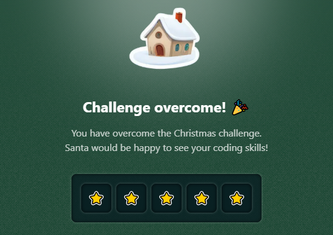

# Challenge 19

The day to give out gifts is approaching! We need to stack the gifts we will transport on the sleigh 🛷, and for that, **we are going to put them in boxes 📦**.

**The gifts can be placed in 4 different boxes**, where each box can hold weights of 1, 2, 5, and 10, represented as follows:

```js
    _
1: |_|
    _____
2: |_____|
    _____
5: |     |
   |_____|

     _________
10: |         |
    |_________|

// JavaScript representation:
const boxRepresentations = {
  1: [" _ ", "|_|"] ,
  2: [" ___ ", "|___|"],
  5: [" _____ ", "|     |", "|_____|"],
  10: [" _________ ", "|         |", "|_________|"]
}
```

Your mission is, upon receiving the weight of the gifts, to **use the fewest boxes possible** and also stack them from less weight (top) to more weight (bottom). **Always aligned to the left**.

Additionally, keep in mind that **when stacking them, the lower edge of the box is reused**.

```js
distributeWeight(1)
// Expected result:
//  _
// |_|

distributeWeight(2)
// Expected result:
//  ___
// |___|

distributeWeight(3)
// Expected result:
//  _
// |_|_
// |___|

distributeWeight(4)
// Expected result:
//  ___
// |___|
// |___|

distributeWeight(5)
// Expected result:
//  _____
// |     |
// |_____|

distributeWeight(6)
// Expected result:
//  _
// |_|___
// |     |
// |_____|
```

### Solutions

- [Python](./solution.py)
- [JavaScript](./solution.js)
- [TypeScript](./solution.ts)

## Stars earned


