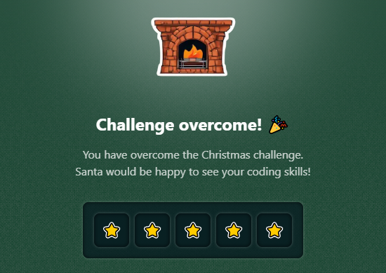

# Challenge 25

We have already distributed all the gifts! Back at the workshop, preparations for next year are already beginning.

A genius elf is creating a magical programming language that will help streamline the delivery of gifts to children in 2025.

Programs always start with the value `0`, and the language is a string where each character represents an instruction:

- `>` Moves to the next instruction.
- `+` Increments the current value by 1.
- `-` Decrements the current value by 1.
- `[` and `]`: Loop. If the current value is `0`, jump to the instruction after `]`. If it is not 0, go back to the instruction after `[`.
- `{` and `}`: Conditional. If the current value is `0`, jump to the instruction after `}`. If it is not `0`, continue to the instruction after `{`.

You need to return the value of the program after executing all the instructions.

> [!NOTE]
> A conditional can have a loop inside, and a loop can also have a conditional inside. But two loops or two conditionals are never nested.

```js
execute('+++') // Expected result: 3
execute('+--') // Expected result: -1
execute('>+++[-]') // Expected result: 0
execute('>>>+{++}') // Expected result: 3
execute('+{[-]+}+') // Expected result: 2
execute('{+}{+}{+}') // Expected result: 0
execute('------[+]++') // Expected result: 2
execute('-[++{-}]+{++++}') // Expected result: 5
```

### Solutions

- [Python](./solution.py)
- [JavaScript](./solution.js)
- [TypeScript](./solution.ts)

## Stars earned


