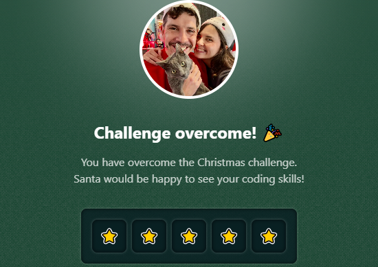

# Challenge 26

Santa Claus has already delivered all the presents! Now he's reviewing the productivity reports of the elves. But there's a problem: **the Product Owner, Mrs. Claus 🧑‍🎄✨**, needs to quickly understand if the elves met the estimated times. They are doing **Agile Scream**.

To help **Mrs. Claus**, your task is to calculate the completed percentage of each task and return it rounded to the nearest whole number. This will allow her to better plan for the next Christmas and keep everyone happy.

This is the function she's expecting:

```js
getCompleted('01:00:00', '03:00:00') // Expected result: '33%'
getCompleted('02:00:00', '04:00:00') // Expected result: '50%'
getCompleted('01:00:00', '01:00:00') // Expected result: '100%'
getCompleted('00:10:00', '01:00:00') // Expected result: '17%'
getCompleted('01:10:10', '03:30:30') // Expected result: '33%'
getCompleted('03:30:30', '05:50:50') // Expected result: '60%'
```

**🎁 Now Santa Claus and the elves deserve a break. We hope they enjoyed AdventJS and will recommend it to their friends!**

### Solutions

- [Python](./solution.py)
- [JavaScript](./solution.js)
- [TypeScript](./solution.ts)

## Stars earned


